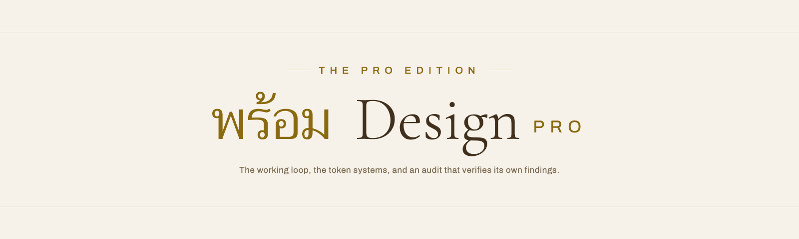

<div align="center">

<a href="https://loop.sv-academy.org"></a>



**Taste is the free part. This is the loop that ships it.**

Learn it free at [loop.sv-academy.org](https://loop.sv-academy.org/articles/prom-design-pro), lesson `prom-design-pro`.

</div>

---

## Start with the free edition

[**sva-admin/sv-academy-prom-design**](https://github.com/sva-admin/sv-academy-prom-design)
is the skill that carries the style: two registers, the five laws, the
component patterns, the copy voice, the imagery rules, and a screenshot gate.
It is complete on its own, it is free, and for "make this page look expensive"
it is the right answer.

This repo is the layer underneath it. The process that produced the style, the
contracts that hold it together, and the harness that verifies it before a
customer sees it. Install both; they are written to sit side by side.

| | Free edition | Pro edition |
|---|---|---|
| Owns | The taste, the patterns, the voice | The process, the contracts, the gates |
| Answers | What should this look like | How does this get built and verified |
| Ships | 12 reference files, `shots.mjs` | 4 references, 2 runnable gates, an audit generator, 2 token contracts |
| Use when | You are making a page | You are running a project |

## Install

Paste this into Claude Code, Codex, or Cursor:

> **Install the skill from https://github.com/sva-admin/prom-design-pro, then run the token gate over my `src` directory and tell me every raw colour that is bypassing my design tokens.**

<details>
<summary>If you would rather install it yourself</summary>

The universal way, which works for Claude Code, Cursor, and the other agents
the `skills` CLI supports:

```bash
npx skills add sva-admin/prom-design-pro
```

As a Claude Code plugin:

```bash
claude plugin marketplace add sva-admin/prom-design-pro
claude plugin install prom-design-pro@prom-design-pro
```

**Cowork:** download this repo, zip `skills/prom-design-pro/`, upload it as a
skill.

</details>

Trigger phrases, chosen not to collide with the free skill: *full design
workflow*, *design audit harness*, *mobile app playbook*, *design contract*,
*token gate*, *contrast fixture*, *density budget*, *multi lens audit*.

## Three pillars

### 1. The working loop, gate by gate

Seven steps, each with the specific failure its gate stands in front of.

| Step | Gate | The failure it prevents |
|---|---|---|
| Brief | Say the plan before building it | Building the wrong register for two days |
| Design contract | No component until tokens exist | Retrofitting a type scale across forty files |
| Build | One vertical slice before breadth | Forty half finished routes |
| Review gate | Localhost link, never a push | A hero that silently fails on a phone |
| Critique | Name your own defects first | Being handed the list by the client |
| Audit | Five sealed lenses, then verify | Shipping a broken flow to a preview |
| Ship | Load the real domain on a phone | Deployed and still wrong |

`references/loop.md` carries the brief and contract templates, the handover
checklist, and the eleven house defect words turned into checks you can run on
yourself before presenting.

### 2. Both token systems, at depth

Two shipped contracts as runnable files, with the reasoning beside every
decision: why the ground is tinted, why the lines are the brand hue at low
alpha, why the type scale has a deliberately empty middle, why the action
colour is called signal and not primary, why state is a token named for the
product fact rather than the colour.

Plus the parts that are usually learned by accident: deriving a dark theme
without inventing a second palette, the contrast budget decided at contract
time, and retrofitting tokens onto a codebase that has none, in five passes.

### 3. The mobile web app pack

The density budget with a real number you measure, the bottom tab bar spec with
its ten rules, twelve compaction moves in the order they pay off, the first run
coach overlay and spotlight cutout, the shadow gallery, and the rules for
borrowing a component without inheriting its skin.

The register exists because of one correction: too much empty space, too much
scrolling, most people are on a phone. One home screen in this house went from
9.8 screens to 3.8, and that did more for how the product felt than any restyle
in the same week.

## Two gates you can run in a second

Both are plain Node. No dependencies, no network, no browser.

### The contrast fixture

Every text token on every surface token, measured rather than estimated. Run
against the cinematic contract this repo ships:

```
$ node scripts/contrast-fixture.mjs assets/tokens-cinematic.css

prom-design contrast fixture
file    tokens-cinematic.css
ground  --ivory   min 4.5:1 normal, 3:1 at 24px and above

REQUIRED  8 pairs
  pass   --gold-ink         on --ivory                  4.54:1   #8A6A11 on #F7F2E9
  pass   --gold-ink         on --cream                  4.85:1   #8A6A11 on #FDFAF3
  pass   --soft             on --ivory                  5.03:1   #7A6448 on #F7F2E9
  pass   --soft             on --cream                  5.38:1   #7A6448 on #FDFAF3
  pass   --brown            on --ivory                  9.09:1   #603813 on #F7F2E9
  pass   --brown            on --cream                  9.72:1   #603813 on #FDFAF3
  pass   --ink              on --ivory                 11.35:1   #40301D on #F7F2E9
  pass   --ink              on --cream                 12.15:1   #40301D on #FDFAF3

INFORMATIONAL  every other colour token on --ivory, not enforced
         --gold-soft                                   1.79:1   below the text floor, so this token is a fill, not type
         --gold                                        2.17:1   below the text floor, so this token is a fill, not type
         --gold-press                                  2.60:1   below the text floor, so this token is a fill, not type

LINE CHECK  a border within 1.08:1 of a surface is invisible on it
  clear: every line token is distinguishable on every surface

8 required, 8 pass, 0 fail
```

That output is the argument for `--gold-ink` in one screen. The accent measures
2.17:1 as text and is unusable for type; the darker sibling measures 4.54:1 and
is tuned to sit just above the floor so it still reads as the accent. An accent
almost always needs a text sibling, and the cheap moment to discover that is at
contract time, not in a review.

Run it on the instrument contract and the line check earns its place:

```
LINE CHECK  a border within 1.08:1 of a surface is invisible on it
  note   --line on --surface-2 is 1.061:1. Do not pair them; use the next line step.
```

Correct, and exactly the bug class to design against: a border that matches an
elevated surface makes that surface invisible, and the failure reads as a
rendering bug rather than a token bug.

### The token gate

Raw colours, bare z-index values, and dashes outside the token files. Here it
is against a component that bypassed the contract:

```
$ node scripts/token-gate.mjs --src src --tokens tokens

prom-design token gate
scanned 2 files under src
token files marked by: tokens
rules: colour, zindex, dash

  FAIL   colour: 2 in 1 files. raw colour outside the token files. Bind it to a token.
         src/components/Card.tsx:4:29  style={{ background: '#fff', border: '1px solid rgba(0,0,0,.08)', zIndex: 40 }}
         src/components/Card.tsx:4:55  style={{ background: '#fff', border: '1px solid rgba(0,0,0,.08)', zIndex: 40 }}
  FAIL   zindex: 1 in 1 files. numeric z-index. Use a named level from the z ladder.
         src/components/Card.tsx:4:73  style={{ background: '#fff', border: '1px solid rgba(0,0,0,.08)', zIndex: 40 }}
  clean  dash

3 violations
```

Exit code 1, so it belongs in CI and in a pre commit hook. Genuine exceptions
carry a `prom-allow` comment that explains itself, rather than a globally
silenced rule.

The fourth rule is the one on the last line. The house forbids em dashes and en
dashes in code, copy, comments and commit messages, and a rule a human has to
remember is a rule that fails on a Friday. The gate scans for the rendered
character, so it fires on a template literal, a translation file, or a component
that a library dropped in.

A token file that components ignore is worse than no token file, because it
reports that the system is healthy while the drift happens somewhere else.

## The audit harness

Six agents. Five sealed lenses in parallel (flows, visual, contrast, code,
content) and then a ranker that re verifies every broken claim against the
source before keeping it.

```
$ node scripts/design-audit.mjs --repo /path/to/src --base http://127.0.0.1:8788 \
    --routes / /events /join --tests 271

Wrote 10 files to ./.design-audit

  00-context.md     the shared brief every lens receives
  01-flows.md       drive the product, find what is broken
  02-visual.md      three widths, and actually look at the screenshots
  03-contrast.md    sample the rendered pixels, not the computed styles
  04-code.md        read the source, do not drive the browser
  05-content.md     inventory, assets, copy defects, temporal validity
  06-rank.md        dedupe, verify, rank by impact, list what is pending
  schema.json       the finding schema every lens returns
  orchestrate.mjs   optional driver for agents that expose agent()
  README.md         how to run it, with or without an orchestrator
```

Four things make it work, and they are the parts to keep if you adapt it:

**Sealed, then reconciled.** Lenses never see each other's output, so when two
of them report the same defect that agreement is corroboration rather than an
echo.

**Rank is falsification, not formatting.** The ranker checks every `broken`
claim against the real source and drops or downgrades what it cannot confirm.
Auditors describing a tree from memory get things wrong, and chasing a finding
that was never real costs more than the finding would have.

**The priors are supplied.** Naming the components that shipped most recently
turns a vague sweep into a hunt.

**The tooling is pre solved.** The port, the browser driver, the sign in
recipe, how to skip the first run tour and whether it lives in local storage or
a cookie. An agent that spends forty percent of its budget working out how to
log in has forty percent less budget for finding defects.

The generator writes prompt files and nothing else. Nothing runs until you
start it.

## What is in the box

```
skills/prom-design-pro/
  SKILL.md                          the front door and the loop
  references/loop.md                brief, contract, build order, gates, how the loop fails
  references/tokens-deep.md         both systems with reasoning, dark themes, retrofits
  references/mobile.md              density, tab bar, compaction, overlays, borrowing
  references/audit-harness.md       the five principles, five lenses, the rank phase
  assets/tokens-cinematic.css       System A, annotated, runnable
  assets/tokens-instrument.css      System B, annotated, runnable
  scripts/token-gate.mjs            the contract, enforced
  scripts/contrast-fixture.mjs      every text token on every surface token
  scripts/design-audit.mjs          generates the six agent audit for your repo
```

Not included: the 360 virtual tour pipeline, which is a different toolchain
entirely.

## Who made this

Built by **Prom** at [SV Academy](https://loop.sv-academy.org), distilled from
the working practice behind real client sites. The clients stay private. The
two example brands, **AURA Heights** and **The Assembly**, are fictional stand
ins carrying the same lessons at full specificity, and they are the same pair
the free edition uses.

SV Academy teaches people to build real things with AI, free, at
[loop.sv-academy.org](https://loop.sv-academy.org). More open skills:
[github.com/sva-admin](https://github.com/sva-admin?tab=repositories).

MIT licensed.
